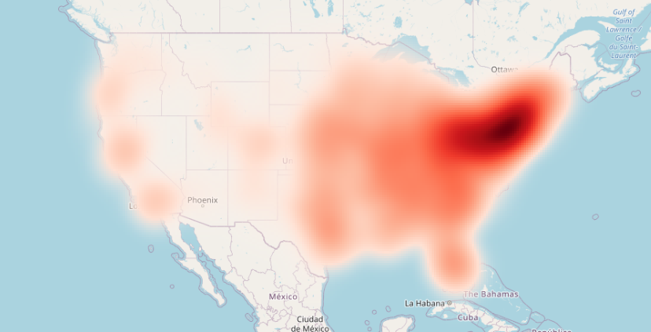

# Fraud detection model in banking transactions

# Описание проекта
Проект выполняется в рамках курса Методы оптимизации. 
Цель: сформировать модель оценки банковской транзакции на основании фиксированного набора аттрибутов ("фичей"), чтобы отнести ее к классу "фрод", либо к к классу "не фрод", так чтобы минимизировать суммарные потери банка.

# Настройка окружения
- склонировать репозиторий
- выполнить загрузку файлов fraudTest.csv и fraudTest.csv с https://www.kaggle.com/kartik2112/fraud-detection
- запустить db_init.bat из проектной директории

# Структура репозитория
- файлы базы данных (fraud.db)
- проект QGIS с анализом картографии (fraudsters_map.qgz)
- исследование фичей на sql (feature_research.sql)
- модель metopt_fraud_beta.ipynb

# План работы
1. Постановка задачи
2. Описательный анализ обучающей выборки
3. Математическая модель
- Алгоритмическое решение математической модели
- Программная реализация математической модели
4. Тестирование результатов
 
# Обучающая выборка
Использована обучающая выборку с разметкой (фрод/не фрод) с соревнования kaggle: https://www.kaggle.com/kartik2112/fraud-detection.

В обучающей выборке 1296675 наблюдений, из них отмечено как "фрод" - 7506 наблюдений (или 0.58%).
Всего в обучающей выборке 23 аттрибута.
По этим данным, соответственно, и буду двигаться по проекту.

Аттрибуты в обучающей выборке можно разделить на 3 ключевые категории: 
- person (информация о плательщике:  first, last, cc_num, dob, zip, gender, street, city, state, zip, lat, long, city_pop, job), 
- merchant (организация-получатель платежа:  merchant, category)
- transaction (информация о транзации: trans_num, unix_time, trans_date_trans_time, merch_lat, merch_long)

Модель данных обучающей выборки в виде графа представлена на рисунке.

Распределение фродстеров на карте (реализовано в qgis: см. fraudsters_map.qgz):

# Тестовая выборка
Использована тестовая выборка с разметкой (фрод/не фрод) с соревнования kaggle: https://www.kaggle.com/kartik2112/fraud-detection.
В обучении данная выборка не участвовала и использовалась для валидации модели.
 
# Целевая функция

Исходим из того, что ошибки 1го и 2го рода имеют разную цену. Цену ошибки можно параметризировать.
Установлены значения по умоланию: Блокировка хорошей добропорядочной транзакции и пропуск мошеннической транзакции будут иметь разную цену.
Соответственно, целевая функция - это сумма потерь, которую нужно минимизировать.

Ошибки 2го и 1го рода : упущенный выигрыш (штраф 10) и реализованный проигрыш (100).

- Цена ошибоки 2го рода (штраф): alpha = - 10
- Цена ошибки 1го рода (штраф): beta = -100
- Цена правильного решения: gamma = +1 
- Целевая функция: alpha * a + beta * b + gamma * c -> max

## Подход к решению 

Будет сформировано несколько стратегий одобрения транзакций из которых будет выбрана та, которая даст минимум.
Результатом реализации модели будет условная вероятность отнесения транзакции к классу фродовой (чем ближе к 1, тем выше вероятность, что операция является фродовой)

Оптимизационная задача будет включать настройку порогового значения, которое позволит максимизировать целевую функцию.

Рассматривается возможность сделать целевую функцию от нескольких переменных.

## Литературный обзор
Особенность алгоритмов поиска фродовых активностей состоит в сильном дисбаласе классов. 

Причины роста мошенничества при проведении операций с банковскими картами, особенности систем фрод-мониторинга рассмотрены в работе [Логинова М.П., Журилко Д.В.](https://www.elibrary.ru/item.asp?id=37399610).

Сравнительный анализ методов машинного обучения при обнаружении мошенничества с банковскими картами приводит [Оголихин И.Д.](https://dspace.susu.ru/xmlui/bitstream/handle/0001.74/29454/2019_412_ogolihinid.pdf?sequence=1), по итогам исследования которого лучший результат показала модель нейронной сети.

Применение моделей машинного обучения на потоке событий приводится в работе [А.Е. Старикова, Д.Е. Намиота](https://cyberleninka.ru/article/n/sistema-vypolneniya-modeley-mashinnogo-obucheniya-na-potoke-sobytiy/viewer), где рассмотрены особенности перевода в промышленную эксплуатацию моделей машинного обучения.

В современном мире все больше банковских транзакций совершаются пользователем в сети интернет. Особенности выявления банковских транзакций в сети описаны в работе [Шейнова А.И., Пастуховой О.Н.](https://www.elibrary.ru/item.asp?id=39560860)

Методы определения мошеннических транзакций с использованием решающих деревьев, алгоритмов кластеризации, нейронных сетей и генетических алготитмов приводятся в работе [Linda Delamaire](http://eprints.hud.ac.uk/id/eprint/19069/1/AbdouCredit.pdf).

Проверка применения градиентного бустинга для определения банковского мошенничества выполнена в работе [Maoguang Wang](https://aisel.aisnet.org/cgi/viewcontent.cgi?article=1031&context=iceb2018), согласно которой наиболее эффективным методом для определения предикторов и их комбинаций является XGBoost, кроме того данный метод обладает большей обобщающей способностью по сравнению с моделью случайного леса.

## Обучение модели

Для обучения модели использовалась модель градиенного бустинга

### Градиентный бустинг: 
XGBoost – строит ансамбль деревьев принятия решений, в основе
которых лежит идея градиентного бустинга. Суть этого метода заключается в
последовательном обучении каждой модели ансамбля, где каждая следующая
модель будет учитывать ошибки предыдущей модели.

принцип метода и особенности реализации в xgboost
Идея градиентного бустинга состоит в построении ансамбля последовательно уточняющих друг друга элементарных моделей. n-ная элементарная модель обучается на “ошибках” ансамбля из n-1 моделей, ответы моделей взвешенно суммируются. “Ошибки” здесь в кавычках, поскольку на самом деле каждая последующая модель приближает антиградиент функции потерь, который не обязательно равен разности фактических и предсказанных значений (т.е. ошибке в буквальном смысле). Различные функции потерь имеют разные производные, но для среднеквадратичной функции потерь, заданной как 12[yi−f(yi)]2, антиградиент (производная с обратным знаком) представляет собой именно разность между фактическими и предсказанными значениями: yi−f(yi). Это наиболее интуитивный вариант, далее в качестве более сложного примера будет рассмотрена логистическая функция потерь.
Элементарная модель здесь названа элементарной вовсе не потому, что она обязана быть очень простой, такой как неглубокое решающее дерево. Под элементарностью подразумевается возможность присутствия модели в качестве составляющей части модели более высокого порядка, в данном случае - модели градиентного бустинга. Бустить можно практически какие угодно модели - общие линейные, обобщенные линейные, деревья решений, K-ближайших соседей и другие, например, на StackOverflow в одном из ответов упоминался бустинг нейросетей с 5 скрытыми слоями. То есть как такового ограничения на сложность модели нет, а есть лишь общая для машинного обучения дилемма смещения-дисперсии (bias-variance tradeoff): модель должна быть достаточно гибкой, чтобы восстанавливать искомую зависимость, но при этом по возможности не должна переобучаться. Элементарная модель в градиентном бустинге известна также как weak learner (непереводимый и довольно абстрактный термин).
К особенностям реализации бустингового алгоритма в xgboost можно отнести использование помимо первой еще и второй производной от функции потерь, наличие встроенной регуляризации, а также возможность задавать пользовательские функции потерь и метрики качества. Первая сугубо техническая особенность повышает эффективность алгоритма. Встроенная регуляризация помогает бороться с переобучением: на очередной итерации решающее дерево не будет строиться до максимальной глубины, если это слишком незначительно улучшает качество модели ценой значительного её усложнения. Наконец, в качестве функции потерь пользователь может задать любую функцию, у которой есть непрерывная первая и вторая производная. Отметим, что в более раннем пакете gbm представлен широкий ассортимент функций потерь в зависимости от распределения целевой переменной:
