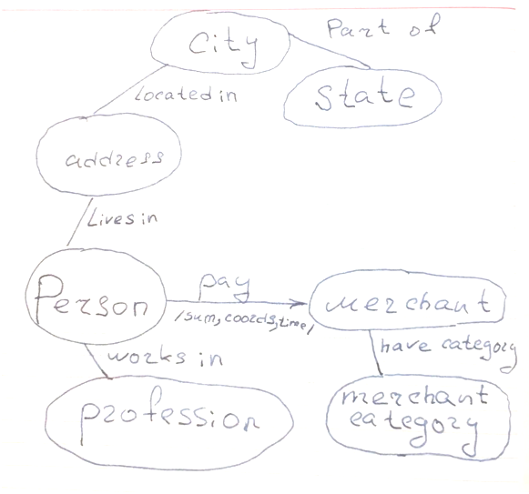

# Fraud detection model in banking transactions

# Описание проекта
Проект выполняется в рамках курса Методы оптимизации. 
Цель: сформировать модель оценки банковской транзакции на основании фиксированного набора аттрибутов ("фичей"), чтобы отнести ее к классу "фрод", либо к к классу "не фрод", так чтобы минимизировать суммарные потери банка.

# Настройка окружения
- склонировать репозиторий
- выполнить загрузку файлов fraudTest.csv и fraudTest.csv с https://www.kaggle.com/kartik2112/fraud-detection
- запустить db_init.bat из проектной директории

# Структура репозитория
- файлы базы данных (fraud.db)
- проект QGIS с анализом картографии (fraudsters_map.qgz)
- исследование фичей на sql (feature_research.sql)
- модель metopt_fraud_beta.ipynb

# План работы
1. Постановка задачи
2. Описательный анализ обучающей выборки
3. Математическая модель:
   3.1. Алгоритмическое решение математической модели
   3.2. Программная реализация математической модели
4. Тестирование результатов
 
# Обучающая выборка
Использована обучающая выборку с разметкой (фрод/не фрод) с соревнования kaggle: https://www.kaggle.com/kartik2112/fraud-detection.
В обучающей выборке 1296675 наблюдений, из них отмечено как "фрод" - 7506 наблюдений (или 0.58%).
Всего в обучающей выборке 23 аттрибута.
По этим данным, соответственно, и буду двигаться по проекту.

# Тестовая выборка
Использована тестовая выборка с разметкой (фрод/не фрод) с соревнования kaggle: https://www.kaggle.com/kartik2112/fraud-detection.
В обучении данная выборка не участвовала и использовалась для валидации модели.
 
# Целевая функция

Исходим из того, что ошибки 1го и 2го рода имеют разную цену. Цену ошибки можно параметризировать.
Установлены значения по умоланию: Блокировка хорошей добропорядочной транзакции будет стоить банку 1 условную единицу потерь, а пропуск мошеннической транзакции будет стоить, 10 условных единиц потерь.
Соответственно, целевая функция - это сумма потерь, которую нужно минимизировать.

Ошибки 2го и 1го рода : упущенный выигрыш (штраф 10) и реализованный проигрыш (100).

- Цена ошибоки 2го рода (штраф): alpha = - 10
- Цена ошибки 1го рода (штраф): beta = -100
- Цена правильного решения: gamma = +1 
- Целевая функция: alpha * a + beta * b + gamma * c -> max

## Подход к решению 

Будет сформировано несколько стратегий одобрения транзакций из которых будет выбрана та, которая даст минимум.
Результатом реализации модели будет условная вероятность отнесения транзакции к классу фродовой (чем ближе к 1, тем выше вероятность, что операция является фродовой)

Оптимизационная задача будет включать настройку порогового значения, которое позволит максимизировать целевую функцию.

Рассматривается возможность сделать целевую функцию от нескольких переменных.

